# Matlab Load Path Plotting Algorithm

This README.md describes features of the MATLAB program prepared for release at the AIAA SciCom 2019 Conference, San Diego 7-11 January 2019 [1]. The program reads mesh data and stresses from text files created by a finite element solution that is run independently by the user. It then defines the vector field and plots the load paths using the Runge-Kutta algorithm described in the paper.

- [Matlab Load Path Plotting Algorithm](#matlab-load-path-plotting-algorithm)
- [Installation](#installation)
- [Example Run](#example-run)
- [Program Features](#program-features)
- [Format of Input Files](#format-of-input-files)
  - [ds.dat](#dsdat)
  - [nodalSolution.txt](#nodalsolutiontxt)
  - [nodeInfo.txt](#nodeinfotxt)
- [References](#references)
- [Example 1 Pin Loaded Hole](#example-1-pin-loaded-hole)
- [Example 5 Simple Cube](#example-5-simple-cube)
- [Example 8 Step – Static Solution](#example-8-step-%E2%80%93-static-solution)

# Installation

The repository can be cloned or downloaded from GitHub:

[Load Path Plotter](https://github.com/GarthPearce/LoadPathMATLAB)

Once the files have been downloaded, change to the directory where the files are contained and run the &quot;LoadPathGUI.m&quot; file. You will see the GUI pop up:

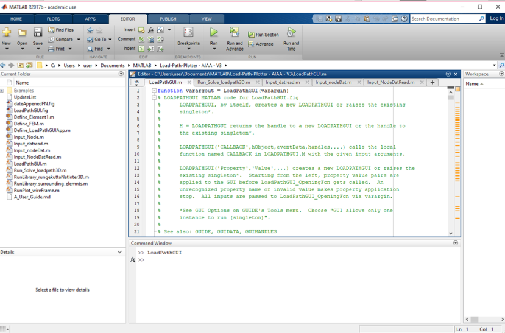

# Example Run

To run the first data set in the Examples Directory.

Simulation Folder Path:
`<MatLab run directory>\Examples\Example 1 Isotropic Plate With Loaded Hole\Simulation Files`

Parallelisation tab – No

Seed Point File:
`<MatLab run directory>\Examples\Example 1 Isotropic Plate With Loaded Hole\Y-Seeds (Primary)`

Path Direction – Y

New pdf – Yes

Recompute – Yes

Save Directory
`<MatLab run directory>\Examples\Example 1 Isotropic Plate With Loaded Hole`

Step Size – 1

Path Length – 100

Minimum Vector Magnitude for Plot – 0.0

Then hit the &quot;Plot Paths&quot; button and the following results will be computed:

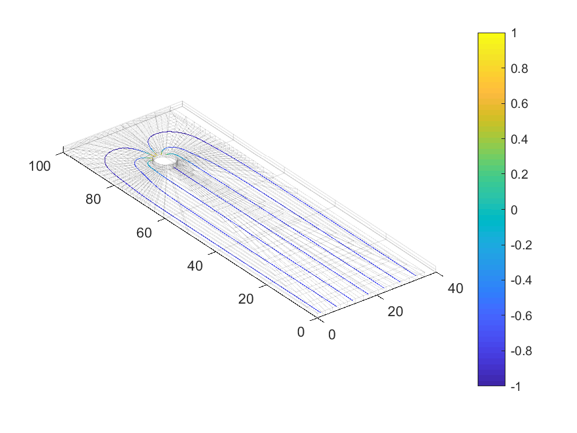

# Program Features

1. The application only works for finite element mesh and stress files created using Hex8 elements (8-noded 3d bricks)
2. The program reads node coordinates and element connectivity from a file (ds.dat)  written to a fixed format.
3. The program reads node stresses from a file (nodalSolution.txt) written to a fixed format.
4. The contours are generated by a Runge-Kutta algorithm (see Reference [1]).
5. Commencing points for the contours are defined.
   1. In a file xxxx.dat identified in the GUI created when the program is run.
   2. If the file is empty the Seeds are generated by the program. A seed is located at the centroid of element with the maximum magnitude of the Load Path Vector selected for the plot. Seeds are created on other elements with the same coordinate (in the Load Path Vector direction) to form a rake.  This method facilitates the plot of the pulse.
6. The program ensures the normal vectors for all element faces  on the HEX8 elements point outwards
   1. Define centroid of element and store in an array
   2. Define centroid of face and vector V1 from centroid of element to centroid of face
   3. Define normal to face Vn as vector cross-product of two edges (store in array)
   4. If vector dot product V1.Vn is positive – ok
   5. If vector dot product V1.Vn is negative – reorder nodes on face and reverse direction of Vn.
7. A simple code is used to determine which element point p0 is inside – may not work for highly distorted meshes.
   1. Loop over all elements
   2. Loop over all faces of the element
   3. Form vector V2 from centroid of the face to p0.
   4. Calculate the vector dot product of V2 and outward face normal.
   5. If all dot products are negative or zero p0 is in that element or on the surface of the element.
   6. If vector dot product is positive for any one face, p0 is outside element.
8. For plot of transient propagation of pulse – see blocks of code ‘if pulse == 1’ in loadpath3D.m
   1. Plot only peak of pulse – In GUI set minimum below which path will not be plotted.
   2. In GUI set maximum for colorbar from review of finite element. Same maximum to be used across all time steps so plot will show change in maximum.
9. To create movie
   1.  Create a set of result files at different time steps
   2.  Run load path program for each result file and store image as bmp file
   3.  Run separate Movie.m program to create avi file.

# Format of Input Files

Two files are required in addition to the data provided in the GUI.  The format for these files defaults to ANSYS format. For other FEA packages the files might need to be edited
1. ds.dat
First 3 lines give a title comment, block information (3D and number of nodes) and read format
Followed by list of node coordinates.
The list ends with “-1”
Title line for Elements, Element type (use et,1,185), block data including number of entries on line and number of elements and line giving format for read.

Followed by list of element node connectivity. Last 9 entries on each line give element number and node connectivity. Only 8-node brick elements are supported for this release. The node numbers need to be sequential (clockwise or anticlockwise) for a back face – then numbered on the front face in the same sequence – see figure below.
The list ends with “-1”

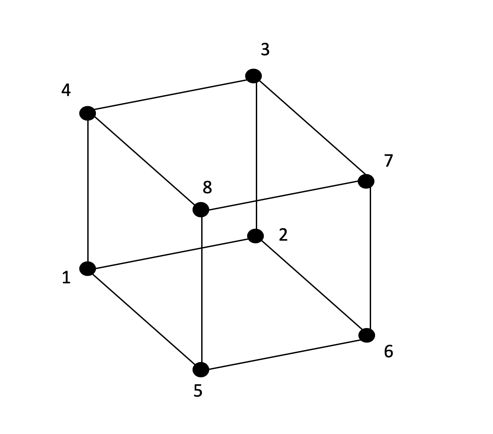

## ds.dat
The data for the &quot;ds.dat&quot; should be formatted as follows:

**For Nodes**
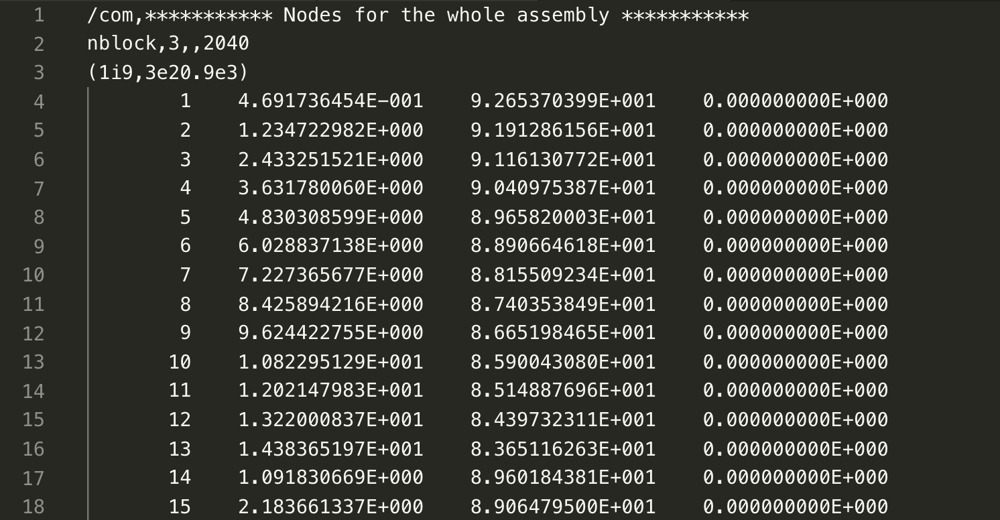

**For Elements**
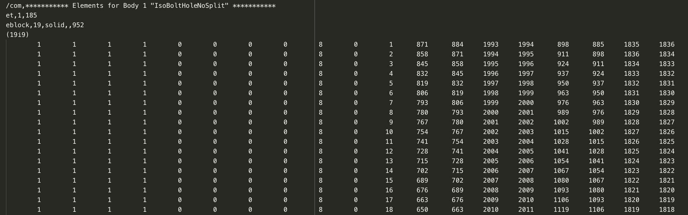

## nodalSolution.txt

The &quot;nodalSolution.txt&quot; file be in the following format:

## nodeInfo.txt

The &quot;nodalInfo.txt&quot; file be in the following format:
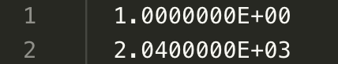

# References
[1] | D. Kelly, G. Pearce and K. Schroder-Turner.  “Plotting Load Paths from Finite Element Stress Results for Aerospace Structures” Proceedings SciTech 2019, January 7-11, San Diego 2019.

# Example 1  Pin Loaded Hole

Example 1 can be produced with the following settings:

This will yield the following plot:

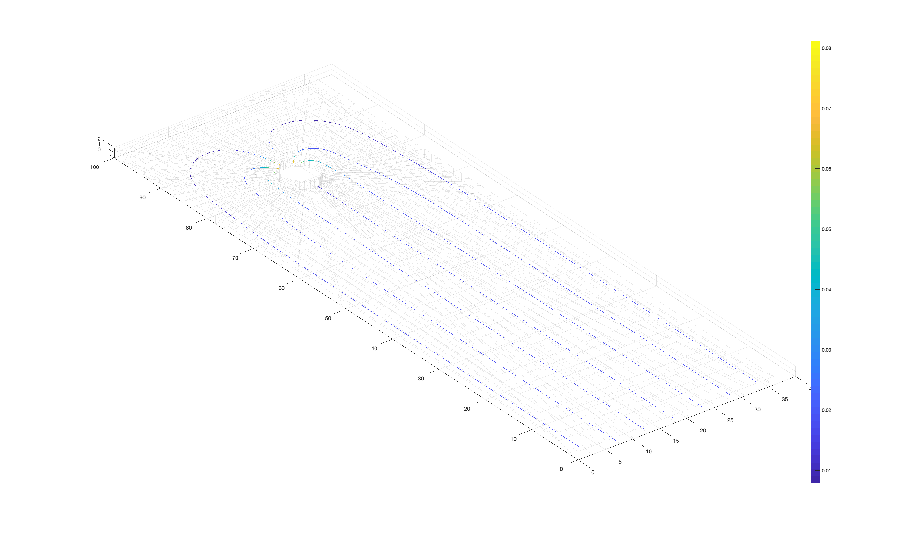

Changing the path direction from &quot;Y&quot; to &quot;X&quot; and selecting the other seed file will yield:

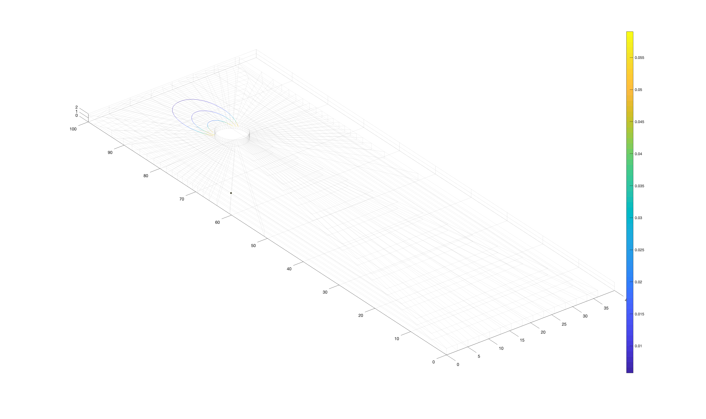

# Example 5 Simple Cube

Example 5 can be produced with the following settings:

This will yield the following plot:

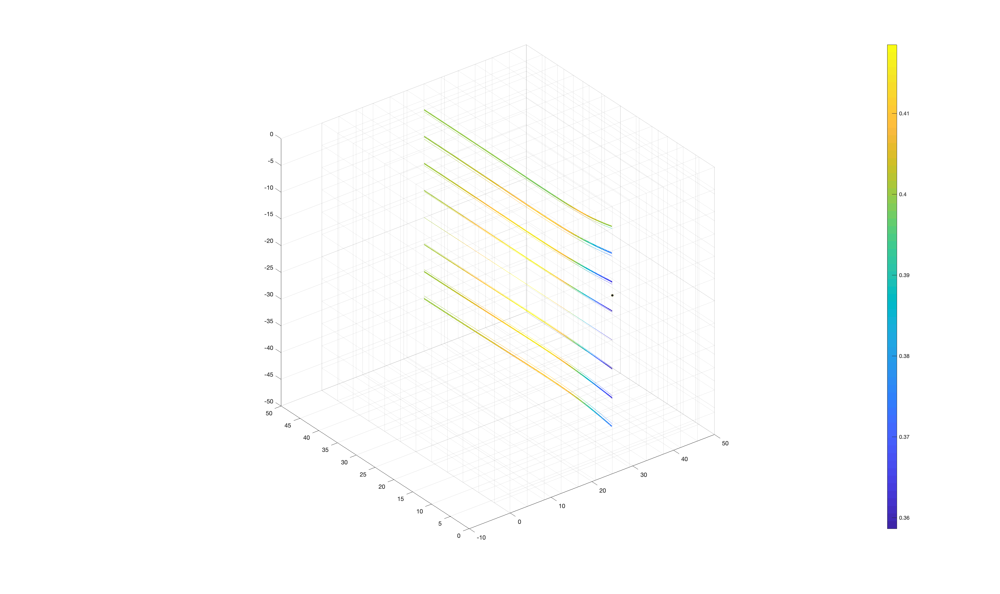

Changing the path direction from &quot;Y&quot; to &quot;X&quot; file will yield (the values in dark blue are very near zeros, hence this can be assumed to be a round off error):

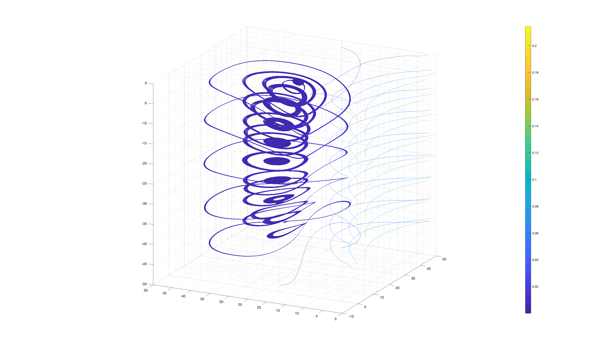

# Example 8 Step – Static Solution

Example 8 can be produced with the following settings:

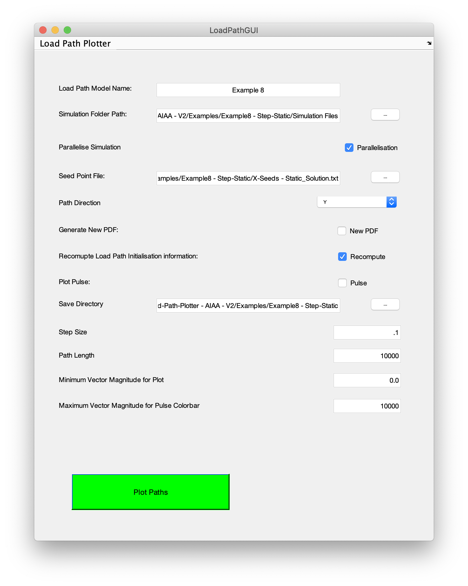

This will yield the following plot:

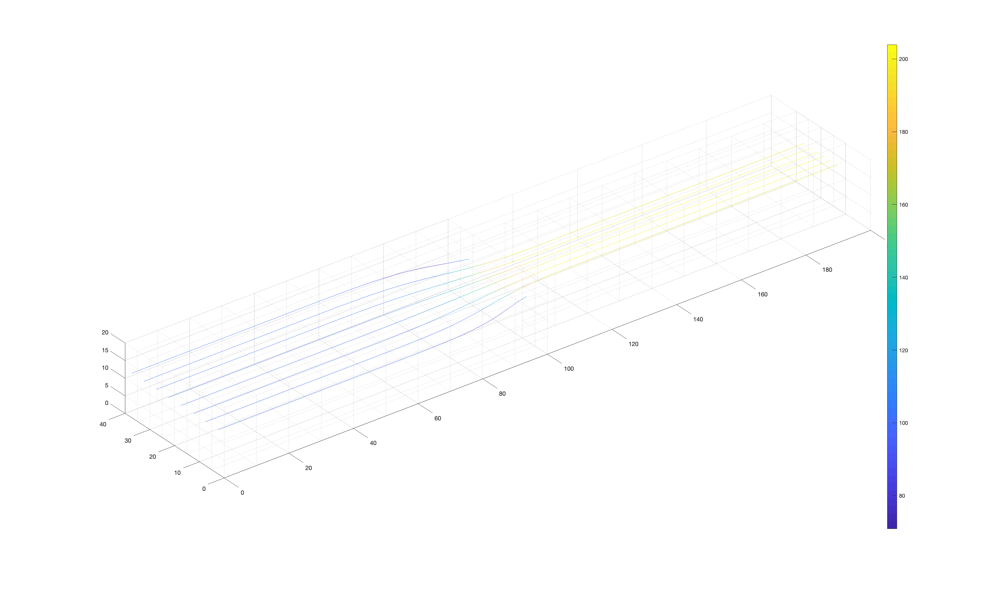

<!-- Changing the path direction from &quot;X&quot; to &quot;Y&quot; will yield:

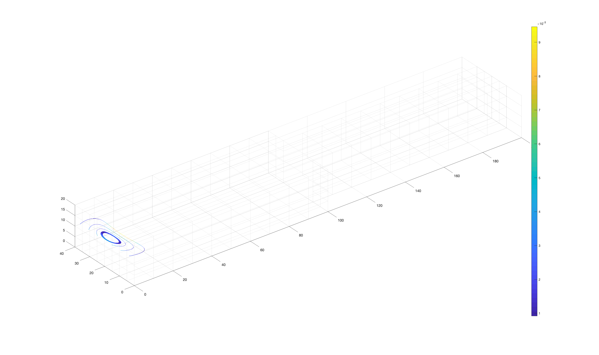 -->
